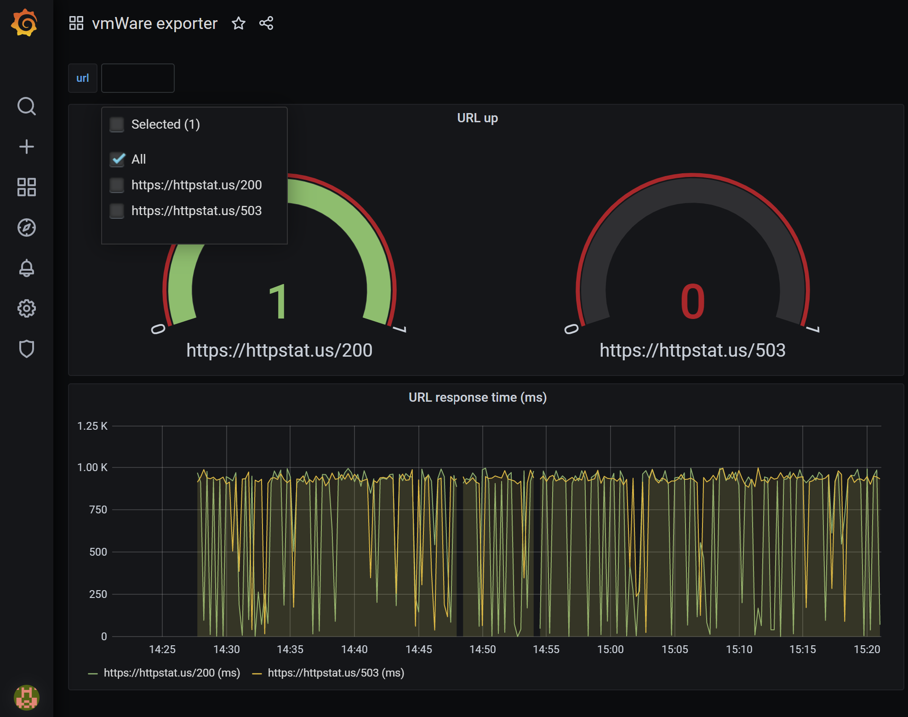

# vmWare exporter application

See ``src`` for the application code.

## Building Docker image

The Python 3 based [Dockerfile](Dockerfile) uses an Alpine Linux base image
and expects the application source code to be volume mounted at `/application`.

We're using multistage Docker build for running unittest as part of the Docker build process.

The last statement shows how we are running the application via `uwsgi` with 2
worker processes.

To build the image:

```
$ docker build -t levtar/vmware_exporter -f Dockerfile .
```

## Running the application

We can just run the web application as follows:

```
$ docker run  -ti --rm -p 5000:5000 --name vmware_exporter levtar/vmware_exporter
```

## Bringing up the exporter application, along with prometheus

The [docker-compse.yml](docker-compose.yml) brings up the `webapp` service which is our web application
using the image `levtar/vmware_exporter` we built above. The [docker-compose-infra.yml](docker-compose-infra.yml)
file brings up the `prometheus` service and also starts the `grafana` service which
is available on port 3000. The config directory contains a `prometheus.yml` file
which sets up the targets for prometheus to scrape. The scrape configuration 
looks as follows:

```
# my global config
global:
  scrape_interval:     15s # By default, scrape targets every 15 seconds.
  evaluation_interval: 15s # By default, scrape targets every 15 seconds.
  # scrape_timeout is set to the global default (10s).

# A scrape configuration containing exactly one endpoint to scrape:
scrape_configs:
  - job_name: 'vmware_exporter'

    # metrics_path defaults to '/metrics'
    # scheme defaults to 'http'.
    static_configs:
        - targets: ['vmware_exporter:5000']
```

Prometheus scrapes our vmware_exporter application on port 5000.
Since these services are running via `docker-compose`, `vmware_exporter` automatically resolves to the IP of the webapp container. 

To bring up all the services:

```
$ docker-compose -f docker-compose.yml -f docker-compose-infra.yml up
```
After running the docker compose you may access Grafana at [http://localhost:3000](http://localhost:3000)
and build your dashboard, which may look like this:


## Deployment to Google Cloud Platform (GCP)

The following procedure is assuming that you are using GCP for running the k8s cluster.

## Cluster provisioning with Terraform
Terraform is used for GCE cluster provisioning.
The cluster is running at single node for cost-effectiveness reason.
To provision kubernetes cluster, run the following from within 'terraform' directory:
- `terraform init` to get the plugins
- `terraform plan` to see the infrastructure plan
- `terraform apply` to apply the infrastructure build
- `terraform destroy` to destroy the built infrastructure (only run at the end of the demo for the cluster cleanup)

**Note:** Due to bug in kubernetes provider `terraform destroy` is failing to remove namespaces and their respective cluster.

## Build docker image for GKE
In order to deploy the vmware_exporter application to GKE we need to build and deploy the Docker image to the Google container registry.
The process should run as part of CI/CD pipeline.
Make sure to replace the PROJECT_ID and BUILD_VERSION with respective values.
```
set PROJECT_ID=<PROJECT_ID>
set BUILD_VERSION=<BUILD_VERSION>
docker build -t gcr.io/${PROJECT_ID}/vmware_exporter:${BUILD_VERSION} .
docker push gcr.io/${PROJECT_ID}/vmware_exporter:${BUILD_VERSION}
```

## Install vmware_exporter application at the k8s environment
For sake of demonstration production release is using GCP load-balancer.
To install helm release, run the following from within 'helm' directory:
- `helm -n production install vmware . -f values.yaml`.  
**Note:** Helm's application access URL notes should be disregarded. Instead of this use bellow instructions.  
Access the vmware_exporter application by running bellow commands.
- `export LOADBALANCER_IP=$(kubectl get --namespace production -o jsonpath="{.status.loadBalancer.ingress[0].ip}" services vmware)`
- `curl $LOADBALANCER_IP/metrics`

Prometheus is the only service that is going to scrap the vmware_exporter.
I don't see reason for defining the ingress controller.

- `helm -n production uninstall vmware` to uninstall the chart

## Additional resources
vmware_exporter is running at [http://34.68.234.150/metrics](http://34.68.234.150/metrics).
The service will be available due 07/07/2020